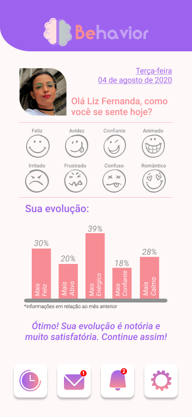
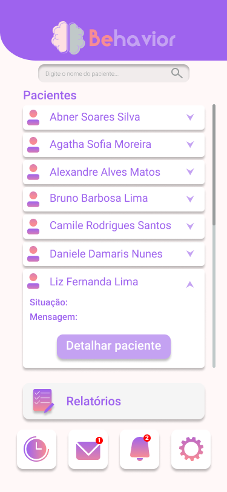

# Behavior

  

  
  
  

> Projeto criado durante o [Call for code Hackathon](https://callforcode.shawee.io/) realizado pela [Shawee](https://shawee.io/).

## 🎥 Video

[Video Pitch]()

[Video Demo]()

## 📱 Mobile

    
    

## 📝 Documentação

[doc]()

## 🚀 Equipe

[Jonatas Pedroso](https://www.linkedin.com/in/jonatas-pedroso-099953151/)

[José Julio](https://www.linkedin.com/in/josejuliommelazzo/)

[Lucas Vanni](https://www.linkedin.com/in/lucas-vanni-a66181145/)

[Luiz Pedro](https://www.linkedin.com/in/luizpedrosm/)

[Manuela Luz](https://www.linkedin.com/in/manuela-luz-862797180)
